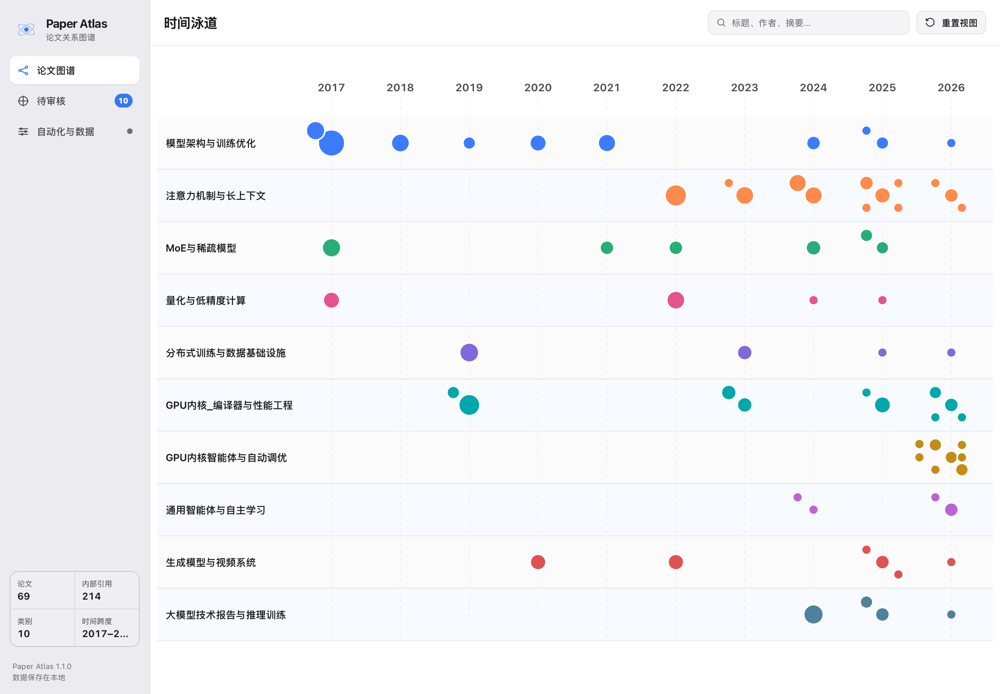

# Paper Atlas

Paper Atlas 是一个本地论文库工具。它按研究方向和年份组织论文，显示库内引用关系，并把近期论文、领域高被引论文与共同引用推荐放在同一个审核流程里。



当前版本：1.0.0

## 使用

### macOS

打开 `Paper Atlas.app`，首次运行时选择保存论文的文件夹。应用会创建并维护 10 个分类目录，运行文件和配置保存在：

```text
~/Library/Application Support/Paper Atlas/runtime
```

应用已经内置通用架构 Python 和 PDF 读取组件。安装到 `/Applications` 后不再依赖克隆仓库、系统 Python、浏览器、常驻终端或首次联网安装依赖。如果 macOS 阻止首次打开，请在 Finder 中右键应用并选择“打开”。

本地测试包位于 `dist/Paper-Atlas-1.0.0.dmg`。公开 Release 只接受经过 Developer ID 签名和 Apple 公证的构建；在证书准备好之前不上传 DMG。

### Windows 与 Linux

需要 Python 3.10 或更高版本。Windows 可以双击 `platform/windows/start-paper-atlas.bat`，也可以在项目目录运行：

```bash
make start
```

首次启动会在项目内创建 `.venv` 并安装 PDF 读取组件。页面只监听本机地址。

## 时间泳道

- 横向位置表示年份，纵向泳道表示分类。
- 节点越大，说明被库内其他论文引用的次数越多。
- 单击节点只显示它的一阶引用关系；双击打开论文详情。
- 橙色箭头表示“本文引用”，蓝色箭头表示“引用本文”。
- “全部引用”开关用于临时查看完整网络，默认关闭以减少视觉干扰。
- 详情中的引用条目会显示本地标题匹配的可信度和证据。

## 论文发现与归档

候选来自三套独立来源：

- arXiv 搜索按主题获取近期论文，并根据标题、摘要、关键词和领域信号计算相关性。低相关结果不会进入候选列表。
- 领域高被引按同一组主题搜索 OpenAlex，再按引用量排序；默认要求至少被引 50 次，可以在按钮旁直接调整下限，每个主题最多保留 5 篇。这个设置会保存下来，并由每天 11:00 的任务继续使用。
- 共同引用从现有论文的参考文献中找出被多篇论文共同引用、但尚未归档的论文。

三个来源会合并去重，已存在于论文库中的同标题论文不会再次进入候选。候选仍按时间倒序排列，并显示来源、被引次数和推荐分类；摘要与元数据校验位于卡片右上角。高被引候选优先根据标题和摘要分类，证据不足时使用命中的搜索主题给出待确认建议。点击“加入论文库”后，Paper Atlas 会依次完成下载、PDF 校验、重复检查、分类归档、决策写入和图谱重建。

归档和决策写入属于同一事务：写入失败时文件会回到原位置。图谱重建失败不会删除已经归档的论文，而是标记为待重试，可以在“运行与数据”中重新构建。

## 每日任务

“运行与数据”中的“App 本机每日任务”可以管理两项任务：

- 论文分类整理：每天 10:30。只自动移动高置信度结果，其余文件留待确认。
- 主题论文发现：每天 11:00，同时获取最新 arXiv 与领域高被引候选。

macOS 使用 `launchd`，关闭 Paper Atlas 后任务仍可按时运行。保存时间后才会安装或更新本机任务。

如果仍保留 Codex 中的同名定时任务，请只启用其中一套调度方式，避免重复执行。App 中显示“尚未安装”时，本机 `launchd` 不会运行这些任务。

## 数据检查与备份

应用启动时会检查：

- 分类目录和本地 PDF 是否对应图谱节点；
- 引用边是否指向有效论文；
- JSON 与页面使用的 JS 数据是否一致；
- 已归档论文是否仍等待图谱更新；
- 候选、审核决策和分类记录是否可读。

“导出备份”保存搜索主题、候选、审核决策、任务时间和图谱清单，不包含论文 PDF。“恢复备份”只接受 Paper Atlas 自己生成的 JSON 文件。

## 当前分类

```text
01_模型架构与训练优化
02_注意力机制与长上下文
03_MoE与稀疏模型
04_量化与低精度计算
05_分布式训练与数据基础设施
06_GPU内核_编译器与性能工程
07_GPU内核智能体与自动调优
08_通用智能体与自主学习
09_生成模型与视频系统
10_大模型技术报告与推理训练
```

## 常用命令

| 命令 | 用途 |
| --- | --- |
| `make start` | 启动浏览器版本 |
| `make classify` | 保守分类新增论文并重建图谱 |
| `make update` | 检查分类并重建图谱，不启动浏览器 |
| `make update-preview` | 重建图谱并手动更新 README 预览图 |
| `make health` | 检查本地文件与生成数据 |
| `make discover` | 搜索最新 arXiv 与领域高被引论文 |
| `make discover-highly-cited` | 只生成领域高被引候选 |
| `make discover-shared` | 生成共同引用候选 |
| `make test` | 运行自动测试 |
| `make python-runtime` | 下载并校验官方通用架构 Python 构建运行时 |
| `make mac-app` | 生成内置 Python 与 PDF 组件的通用架构 macOS 应用 |
| `make release` | 生成临时签名的本地测试 DMG 和 SHA-256 |
| `make release-public` | 生成正式 DMG；强制要求 Developer ID 和 Apple 公证 |
| `make release-check` | 执行发布一致性检查 |

## 数据来源与隐私

论文标题、摘要、作者和 arXiv 链接来自 arXiv；外部引用和引用量来自 OpenAlex；库内引用由本地 PDF 参考文献标题匹配得到。候选仍应在归档前人工核对。

论文 PDF 不会上传到仓库或第三方。论文整理、图谱浏览和已下载 PDF 解析可以完全离线运行；执行论文发现时仍需联网，论文标题会发送给 OpenAlex 用于引用匹配，搜索关键词会发送给 arXiv 和 OpenAlex。应用没有用户账户、遥测或云同步。

打包时会为应用内运行目录生成干净的初始状态：自定义搜索主题、推荐候选和审核记录全部清空，并检查是否残留用户绝对路径。这个过程只修改应用包，不会删除本地论文库或 `Application Support` 中的现有状态。

仓库包含应用代码、公开论文元数据、候选记录和示例图谱，不包含论文 PDF。

## 常见问题

### 应用打不开

本地测试包使用临时签名，可能需要在 Finder 中右键应用并选择“打开”。公开发布包必须通过 Developer ID 签名和 Apple 公证。

### 页面提示管理功能未连接

退出并重新打开应用。浏览器版本请使用 `make start`，不要直接打开 `web/index.html`。

### 论文已归档但图谱没有更新

打开“运行与数据”，查看具体错误并点击“重新检查并构建”。已下载的 PDF 和审核决策会保留。

### 每日任务运行了两次

检查是否同时启用了 Paper Atlas 的 `launchd` 任务和 Codex 定时任务，只保留一套。仅在 App 中设置了时间、但没有点击“保存并启用”，不会安装 `launchd` 任务。

### 自动整理后 Chrome 意外退出

自动分类与图谱更新不再调用 Chrome。`preview.png` 只会在开发者手动运行 `make update-preview` 时更新，因此不会影响每天的后台任务或 Paper Atlas App。

### arXiv 结果偏离主题

在“搜索主题”中使用更具体的多词关键词，并添加排除词。候选卡片会显示实际命中位置和相关性分数。

## 开发与发布

```bash
python3 -m pip install -r requirements.txt
make test
make mac-app
```

`make mac-app` 首次运行会下载并验证 Python.org 的通用架构 Python 3.12 运行时，之后复用 `.cache/python-runtime`。前端不需要 npm 构建。修改 `web/` 后刷新页面即可。

`Paper Atlas.app` 和 `dist/` 都是本机构建产物，不提交到仓库。GitHub Actions 只验证源码能否通过测试、构建和发布检查，不保存临时签名安装包。

生成本地测试 DMG：

```bash
make release
```

生成允许公开上传的 Developer ID 签名、公证版本：

```bash
PAPER_ATLAS_SIGN_IDENTITY="Developer ID Application: Your Name (TEAMID)" \
PAPER_ATLAS_NOTARY_PROFILE="paper-atlas-notary" \
make release-public
```

`PAPER_ATLAS_NOTARY_PROFILE` 需要先用 `xcrun notarytool store-credentials` 保存。`make release-public` 会在缺少证书、公证配置或公证票据时直接失败；没有 Apple Developer 证书时只能使用 `make release` 生成不对外发布的测试包。

项目采用 MIT License，版本变化见 [CHANGELOG.md](CHANGELOG.md)。
